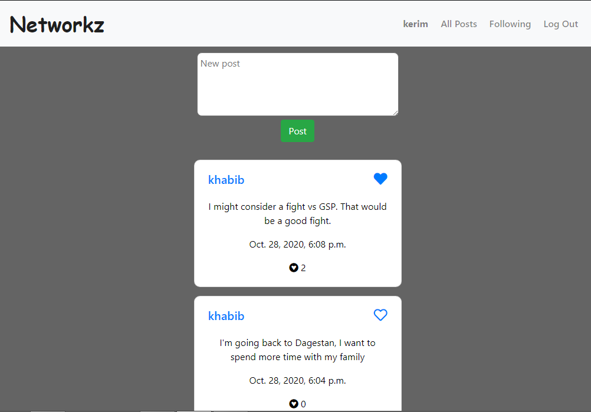

# Social Network

* allows users to create posts, like/unlike posts, follow other users, all with live updates
* backend: Django API endpoints that return JSON data
* frontend: Vanilla Javascript

https://networkz-social.herokuapp.com

# Sample screen

